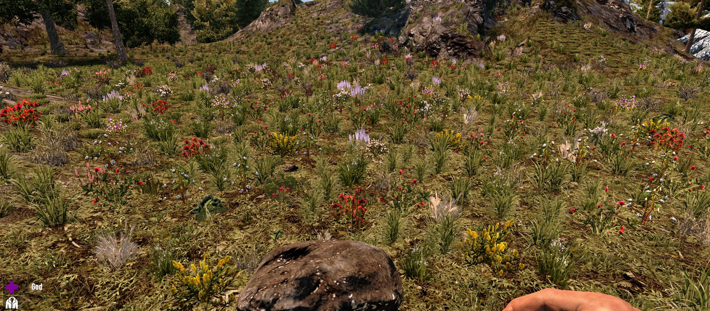
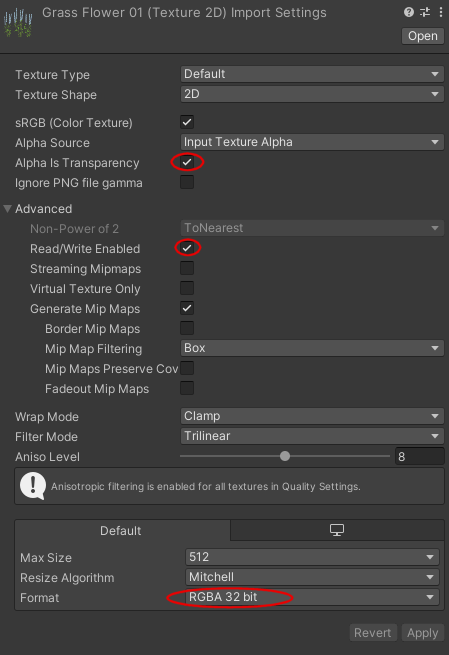
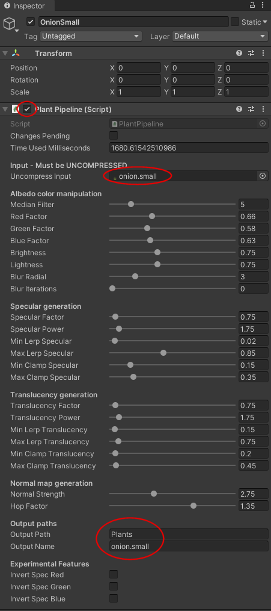
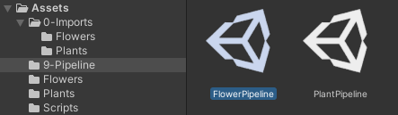
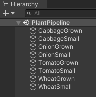
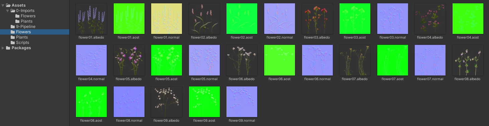
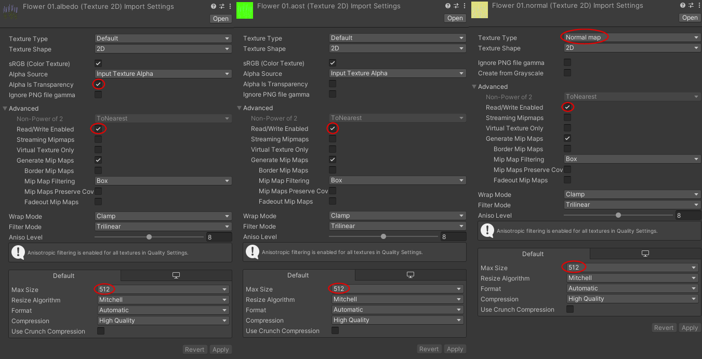

# OCB Demo Mod for Custom Texture Atlas  - 7 Days to Die (A20) Addon

This mod adds a few custom grass textures and blocks.
Requires [OcbCustomTextures][1] Mod to actually do anything!

## How does it work

The required core mode does all the patching of the textures. This
is done by cutting out existing textures from the big atlas, then
adding any newly added texture, and finally creating a new atlas
and updating the UV XML configs so all materials/meshes reference
the correct sub-square of the newly created atlas.

### Demo mod content

This demo mod includes a bit more than the custom paint textures mod.
Reason for this is that it is much more difficult to provide proper
textures for the grass shader. Patching the atlas, which the core mod
does, is really just a first step to make this truly work.

This mod is meant as an example for other modders to add their own
plants, or they can re-use the unity3d resources this mod provides
for their own mod (I may create one myself for food expansion mod).
You can still use this mod to just add more variety into you biomes.
The plants will be randomly placed for visual pleasure, but they will
not give any additional resources (just plant fibers as other grass).

## Unity grass pipeline

In order to ease the burden to create proper textures for your plant,
this mod includes a Unity Editor Script that acts as a pre-processor
Pipeline. Note that I'm not that fluent in unity, so there might be a
better way to achieve what it currently does. None the less, it already
produces pretty nice results.

I didn't really find any OOTB usable assets to download or even buy, that
would fit for the grass shader TFP uses. It expects a normal map and a
special "specular" map, which seems to define Ambient Occlusion in the
red channel, Specular in green and "Translucency" in blue. I decided
to call this special map AOST (Occlusion/Specular/Translucency).

If you want to check out how the specular map is actually sampled,
I have re-created TFP's grass shader previously in another Mod:
https://github.com/OCB7D2D/OcbPrettyGrass

### Albedo Map

This is the main texture of the grass/plant you want to add. All other
required maps (normal, specular/AOST) can be generated from this map.
You must make sure that you set the texture to "uncompressed" when
importing, as we only need it as the input for the Grass Pipeline.

### Normal and AOST Map

When using the Grass Pipeline Editor Script, you can create these
maps (and also the final albedo map) from the input texture, and
again, make sure you import this texture without any compression!

The editor script will create the maps according to the settings
and stores the results as PNG in the output folder. When you load
a pipeline scene it can take a few minutes, as it will re-create
the textures first. Note that I didn't optimize this to death, so
it will re-create stuff sometimes; just be patient with it.

Note: we don't include the actual resulting PNGs in this repo
in order to safe space and since it is not needed. If you want
to re-create the existing unity3d resources you'll need to load
those pipelines yourself to re-create the PNG's and then export
them. Unfortunately Unity deletes the metadata to those textures,
if we don't include any image PNG at all, so we replace all the
expected textures with a placeholder, so the metadata is kept.

### Exporting the resulting textures

Once you load the pipelines, all textures should be re-created.
As whenever you adjust a setting in a Grass Pipeline Script.

Most importantly you must export the textures as 512x512 textures.
Although the patcher can work with all kind of resolutions, it seems
the grass swaying shader has issues if the input texture is not 512px.

## Copyrights for used assets

- https://www.subpng.com/png-7bc5ki (Tomato Small)
- https://www.subpng.com/png-dbwit5 (Tomato Grown)
- https://www.pngegg.com/en/png-dzivh (Onion Plant)
- https://pngset.com/download-free-png-lzsxs (Wheat)
- https://cutewallpaper.org/24/cabbage-transparent/263218838.html (Cabbage)
- https://assetstore.unity.com/packages/2d/textures-materials/nature/grass-flowers-pack-free-138810

## Changelog

### Version 0.6.0

- Update compatibility for 7D2D A21.1(b15)

### Version 0.1.0

- Initial version

## Compatibility

Developed initially for version a20.3(b3), updated through A21.1(b15).

[1]: https://github.com/OCB7D2D/OcbCustomTextures
